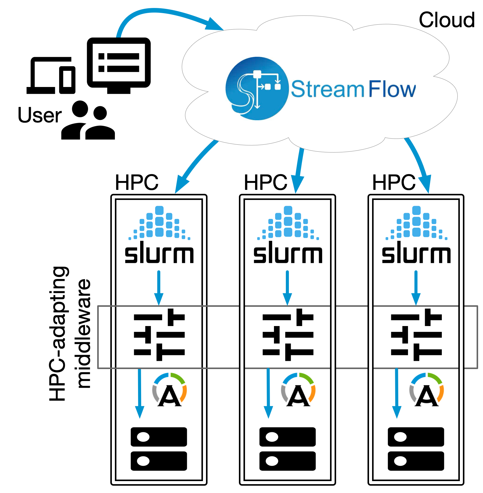

# Cross-Facility Federated Learning (xFFL)

[Cross-Facility Federated Learning (xFFL)](https://hpc4ai.unito.it/hpc-federation/) is a federated learning (FL) framework based on the [StreamFlow workflow management system (WMS)](https://streamflow.di.unito.it) developed in the [Parallel Computing \[Alpha\] research group](https://alpha.di.unito.it) at the University of Turin, Italy.

xFFL is designed to be a research-oriented software, enabling FL workloads deployment on geographically distributed computing infrastructures including, but not limited to, high-performance computers (HPCs).

We aim to democratize extensive ML workload development, allowing researchers and SMEs to be competitive with big tech companies by exploiting sparse computing power.


## Get started

### Setup
Clone this repository on the computing infrastructure that will act as the federation orchestrator:
```bash
git clone --depth 1 --branch main https://github.com/alpha-unito/xffl.git
```
Note that this machine should have internet access and be capable of reaching the federation clients through SSH.

Create and activate a Python virtual environment (both venv and conda are valid options):
```bash
python3 -m venv xFFL
source xFFL/bin/activate
```

Install xFFL and its requirements:
```bash
cd xffl/
python3 -m pip install .
```

### Configuration creation
Create an xFFL configuration file in a guided way through the xFFL CLI:
```bash
xffl config --w [workdir] --p [project]
```
Where `workdir` is the name of the working directory to create (defaults to the local directory), and `project` is the name of the created deployment.
This process will produce a directory containing the necessary StreamFlow and xFFL configuration files and the chosen model.


## System requirements

Python>=3.9  
Singularity/Docker  
NodeJS


## Architecture

xFFL implements a centralized FL schema in which a central server coordinates, distributes, and aggregates the learning tasks deployed on the clients. Such a process is orchestrated by StreamFlow, which handles the data movement between the computing infrastructures and the deployment of workloads.




## Contributors

| Name                                                               | Email                        | Role                     |
| :----------------------------------------------------------------- | :--------------------------- | :----------------------- |
| [Gianluca Mittone](https://alpha.di.unito.it/gianluca-mittone/)    | <gianluca.mittone@unito.it>  | Creator and maintainer   |
| [Alberto Mulone](https://alpha.di.unito.it/alberto-mulone/)        | <alberto.mulone@unito.it>    | Developer and maintainer |  
| [Iacopo Colonnelli](https://alpha.di.unito.it/iacopo-colonnelli/)  | <iacopo.colonnelli@unito.it> | Investigator             | 
| [Robert Birke](https://alpha.di.unito.it/robert-rene-maria-birke/) | <robert.birke@unito.it>      | Investigator             |   
| [Marco Aldinucci](https://alpha.di.unito.it/marco-aldinucci/)      | <marco.aldinucci@unito.it>   | Principal investigator   |
